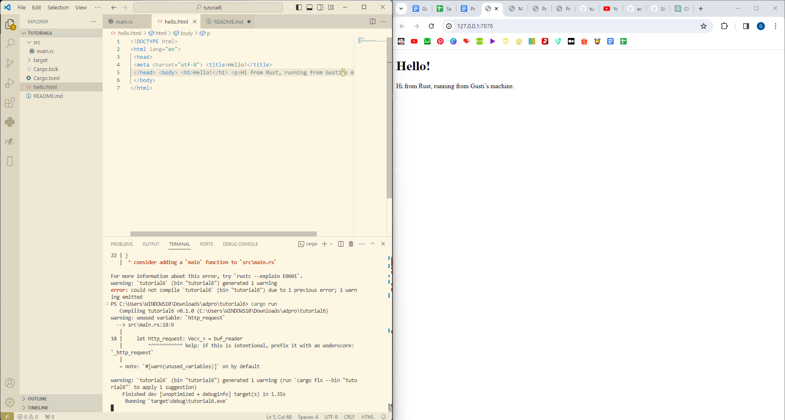

## Commit 1 Reflection Notes

The function initially wraps the input stream with a BufReader for efficient content reading. It then iterates over each line from the stream using a line iterator, mapping operations to convert them into strings. These strings are processed until an empty line is encountered, accumulating into an http_request vector. Finally, this vector, containing the HTTP request information, is printed to the terminal. The function efficiently parses incoming streams by iteratively extracting HTTP request details. Through a sequence of mapping and iteration operations, it constructs a structured representation of the request, suitable for further processing or analysis.

## Commit 2 Reflection Notes 

Initially, the program employs a similar method as previously described to read the incoming request. Once the request is obtained and read, the program proceeds to construct an HTTP Response. This response comprises three key components: a status line containing the HTTP version, status code, and status message; the Content-length header indicating the length of the content; and finally, the content itself, which in this instance is the HTML to be served.

To create the response, the program first segregates each of these components into separate string variables. Subsequently, through string formatting techniques, the program amalgamates these features into a single string, adhering to the specified order: status line, Content-length header, and content. The status line and Content-length header are delimited by a single \r\n, while the header section and content section are separated by two \r\ns. Once the response string is assembled, the program proceeds to write it back into the stream as bytes, thereby furnishing the client with the requested HTML response.

In summary, following the acquisition of the request, the program dynamically constructs an HTTP Response by amalgamating essential components into a structured string format. This response string, delineated by specific delimiters, is then transmitted back to the client via the stream, ensuring the prompt delivery of the requested HTML content.

